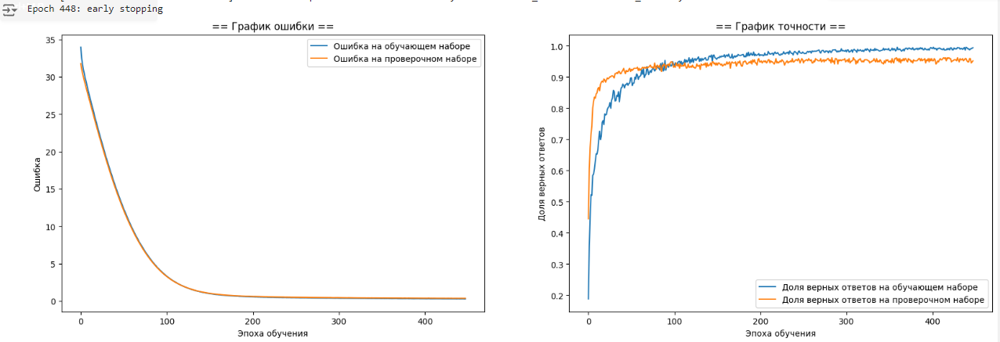
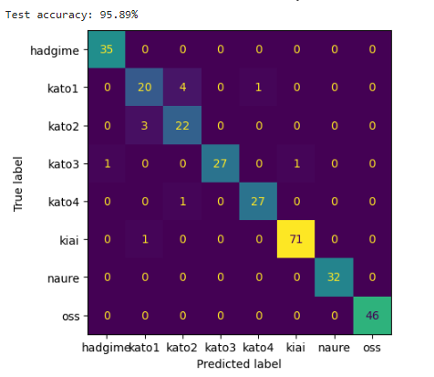

# Отчет Марценко Виталия (стажёра) по ходу стажировки "Разработка модели для классификации ударов КАРАТЭ и типовых ошибок при отработке серии ударов (като) (Московская Федерация Кёкусинкай)"

## Постановка задачи
Решаем задачу классификации аудио - команд КАРАТЭ, произнесенных спортсменами и судьями.
Для решения основной задачи, по классификации ударов КАРАТЭ, возникла необходимость сопоставлять видео с 4 камер, и определять отсчеку, когда будет запускаться и останавливаться нейросеть. В связи с этим была определена дополнительная задача по классификации команд КАРАТЭ.

После анализа датасета, предоставленного заказчиком, было выявлено 8 классов команд:
```
labels_list = ['hadgime', 'kato1', 'kato2', 'kato3', 'kato4', 'kiai', 'naure', 'oss']
```
1. **'hadgime'** - команда от судьи, после нее спорстмен начинает выступление. Необходима для сопоставления видео с 4 камер, и запуска нейросети по классификации ударов КАРАТЭ.
2. **'kato1', 'kato2', 'kato3', 'kato4'** - названия като, которое спорстмен будет выполнять.
3. **'kiai'** - клич, который спортсмен просизносит в момент выполнения удара.
4. **'naure'** - команда от судьи, после нее спорстмен заканчивает выступление. Необходима для остановки нейросети классификации ударов КАРАТЭ.
5. **'oss'** - команда, которую спортсмен произносит во время поклона.

Необходимо создать модель, которая будет получать на вход аудио, на выходе выдавать название команды, временную метку и номер кадра видео, для определения, когда эта команда была произнесена.

## Решение
### Шаг 1.Разметка датасета
Заказчик предоставил датасет: видео с выступлениями спортсменов, далее необходимо сформировать аудио-датасет.

1. Вырезал аудио из видео с помощью библиотеки moviepy.
2. Разметка датасета выполнялась в программе "Audacity", на выходе получили аудио файлы и txt файлы с временными метками по каждой команде.
3. Разработал скрипт для формирования датасета (нарезает команды в соттветствии с временными метками, и сохраняет их по папкам с названием команды).

### Шаг 2.Анализ и корректировка датасета
1. Проанализировал датасет по громкости и длительности аудио.
2. Для улучшения обучения модели, и проведения стратификационной разбивки на тренировочную и проверочную выборки, аудио по каждому классу датасета разбил на 4 группы (2 группы по громкости, 2 группы по длительности).
3. При разметке датасета, некоторые команды были размечены "c запасом" (тишина до и после клича), поэтому была проведена подрезка тишины, для приведения к одному виду.
4. Была проведена чистка датасета от выбросов.
5. Получили финальный датасет.

*Статистика датасета*


### Шаг 3.Извлечение признаков из аудио
#### Модель YAMNet от Tensorflow
Для извлечения признаков из аудио была выбрана предобученная модель YAMNet от Tensorflow.
1. Прогнал датасет через модель YAMNet, на выходе по каждому аудио получил эмбеддинг (вектор длиной 1024 с признаками аудио).
2. При проведении экспериментов модель обученная на эмбедингах показала максимальную точность 88.3% на проверочной выборке. Но при проведении тестирования на полных аудио (с выступлением спортсменов), модель допускала много ложных предсказаний с высоким confidence.

#### Признаки, извлеченные через библиотеку Librosa
1. Экспериментальным путем было выявлено, что наилучший результат получился при извлечении следующих признаков:
   - MFCC (40 коэффициентов)
   - Zero Crossing Rate (частота пересечения нуля)
   - Спектральная ширина
   - Спектральный центроид
   - RMS (энергия звука)
2. Взял средние значения по каждому признаку, объеденил в один вектор, выполнил нормализацию с применением StandardScaler.

### Шаг 4.Обучение модели
1. Датасет был разбит на тренировочную и проверочную выборки 80/20
2. Модель показала максимальную точность 95.89% на проверочной выборке:

*График обучения модели*


*ConfusionMatrix*



### Шаг 5.Тестирование модели
1. Для тестирования модели была разработана функция, которая принимает на вход полное аудио (с выступлением спортсменов), и нарезает его окном 1 секунда, со смещением 0.25 секунды. 
2. Было проведено тестирование на 4 аудио с разными като, получены следующие результаты:

```20240209_181457.wav
Метки:
5.683204	6.392208	oss
9.378961	10.026556	oss
10.601575	11.653243	kato1
16.611398	17.393018	hadgime
24.968415	25.990837	kia
33.747823	34.679451	kia
40.090590	41.189003	naure

Предсказания модели:
Время: 5.00 - 6.00 секунд, Номер кадра: 150 - 180, Предсказание: oss, Confidence: 100.00%
Время: 8.75 - 9.75 секунд, Номер кадра: 262 - 292, Предсказание: oss, Confidence: 100.00%
Время: 10.50 - 11.50 секунд, Номер кадра: 315 - 345, Предсказание: kato1, Confidence: 63.36%
Время: 11.75 - 12.75 секунд, Номер кадра: 352 - 382, Предсказание: kato2, Confidence: 99.13%
Время: 15.75 - 16.75 секунд, Номер кадра: 472 - 502, Предсказание: hadgime, Confidence: 99.97%
Время: 24.25 - 25.25 секунд, Номер кадра: 727 - 757, Предсказание: kiai, Confidence: 100.00%
Время: 33.00 - 34.00 секунд, Номер кадра: 990 - 1020, Предсказание: kiai, Confidence: 100.00%
Время: 39.75 - 40.75 секунд, Номер кадра: 1192 - 1222, Предсказание: naure, Confidence: 92.80%
Прозвучала команда "naure", выступление спортсмена закончено, прекращаю анализ аудио

20240209_181853.wav
Метки:
2.940655	3.432403	oss
5.242036	5.832134	oss
6.212055	7.348135	kato4
10.258177	11.039797	hadgime
20.065830	21.055321	kia
29.758148	30.888437	kia
36.621348	37.595769	naure

Предсказания модели:
Время: 2.25 - 3.25 секунд, Номер кадра: 67 - 97, Предсказание: oss, Confidence: 97.04%
Время: 5.00 - 6.00 секунд, Номер кадра: 150 - 180, Предсказание: oss, Confidence: 99.86%
Время: 6.25 - 7.25 секунд, Номер кадра: 187 - 217, Предсказание: kato4, Confidence: 98.15%
Время: 9.75 - 10.75 секунд, Номер кадра: 292 - 322, Предсказание: hadgime, Confidence: 91.61%
Время: 19.25 - 20.25 секунд, Номер кадра: 577 - 607, Предсказание: kiai, Confidence: 99.80%
Время: 25.25 - 26.25 секунд, Номер кадра: 757 - 787, Предсказание: kato2, Confidence: 97.66%
Время: 29.00 - 30.00 секунд, Номер кадра: 870 - 900, Предсказание: kiai, Confidence: 100.00%
Время: 36.50 - 37.50 секунд, Номер кадра: 1095 - 1125, Предсказание: naure, Confidence: 95.03%
Прозвучала команда "naure", выступление спортсмена закончено, прекращаю анализ аудио

20240209_181632.wav
Метки:
3.757333	4.535777	oss
6.499780	7.172268	oss
7.186337	8.322417	kato2
11.364684	12.146304	hadgime
20.395598	21.465065	kia
30.389914	31.203845	kia
36.954776	37.866142	naure

Предсказания модели:
Время: 3.25 - 4.25 секунд, Номер кадра: 97 - 127, Предсказание: oss, Confidence: 99.99%
Время: 6.00 - 7.00 секунд, Номер кадра: 180 - 210, Предсказание: oss, Confidence: 100.00%
Время: 7.25 - 8.25 секунд, Номер кадра: 217 - 247, Предсказание: kato2, Confidence: 97.17%
Время: 10.50 - 11.50 секунд, Номер кадра: 315 - 345, Предсказание: hadgime, Confidence: 94.66%
Время: 19.75 - 20.75 секунд, Номер кадра: 592 - 622, Предсказание: kiai, Confidence: 100.00%
Время: 30.50 - 31.50 секунд, Номер кадра: 915 - 945, Предсказание: kiai, Confidence: 95.55%
Время: 31.75 - 32.75 секунд, Номер кадра: 952 - 982, Предсказание: kato2, Confidence: 98.16%
Время: 36.50 - 37.50 секунд, Номер кадра: 1095 - 1125, Предсказание: naure, Confidence: 97.63%
Прозвучала команда "naure", выступление спортсмена закончено, прекращаю анализ аудио

20240209_181745.wav
Метки:
4.054910	4.833354	oss
6.753474	7.425962	oss
7.819273	9.104614	kato3
12.634983	13.592688	hadgime
21.283945	22.353412	kia
30.570727	31.704593	kia
36.680956	37.281620	naure

Предсказания модели:
Время: 3.25 - 4.25 секунд, Номер кадра: 97 - 127, Предсказание: oss, Confidence: 89.84%
Время: 6.00 - 7.00 секунд, Номер кадра: 180 - 210, Предсказание: oss, Confidence: 90.75%
Время: 8.00 - 9.00 секунд, Номер кадра: 240 - 270, Предсказание: kato3, Confidence: 96.80%
Время: 12.00 - 13.00 секунд, Номер кадра: 360 - 390, Предсказание: hadgime, Confidence: 98.93%
Время: 20.50 - 21.50 секунд, Номер кадра: 615 - 645, Предсказание: kiai, Confidence: 99.89%
Время: 22.25 - 23.25 секунд, Номер кадра: 667 - 697, Предсказание: naure, Confidence: 93.92%
Время: 30.00 - 31.00 секунд, Номер кадра: 900 - 930, Предсказание: kiai, Confidence: 100.00%
Время: 35.75 - 36.75 секунд, Номер кадра: 1072 - 1102, Предсказание: naure, Confidence: 95.20%
Прозвучала команда "naure", выступление спортсмена закончено, прекращаю анализ аудио
```

## Итоги
По аналогии, была разработана функция, которая принимает на вход аудиопоток, и выдает предсказание модели, временную метку, и номер кадра. Данную функцию можно использовать как для сопоставления видео с разных камер, определения отсечки, когда будет запускаться и останавливаться нейросеть по классификации ударов КАРАТЭ, так и для фиксирования команд, произнесенных спортсменом во время выступления.


## Использованные инструменты:
- **Язык программирования:** Python
- **Библиотеки:** TensorFlow, Keras, NumPy, Matplotlib, Pandas, Sklearn, Librosa, Wave, Soundfile, Sounddevice, Pydub, Moviepy, Pickle
- **Среда разработки:** Jupyter Notebook / Google Colab
